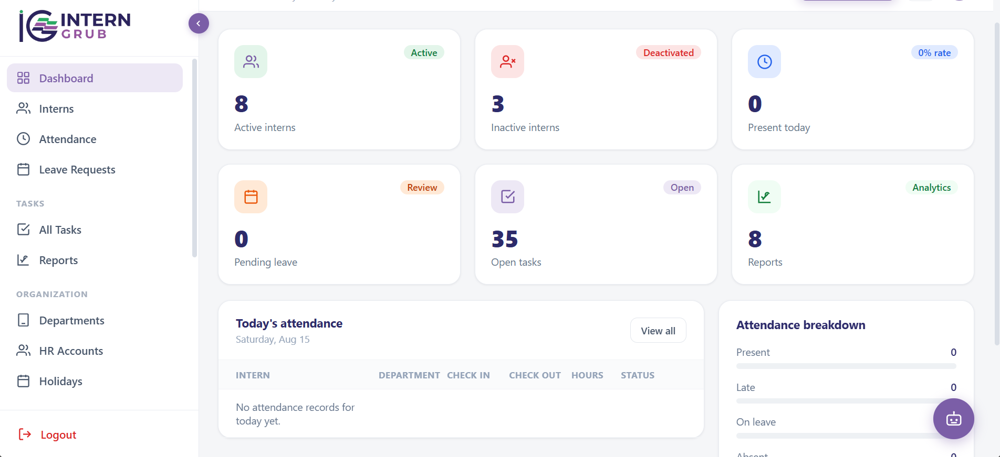
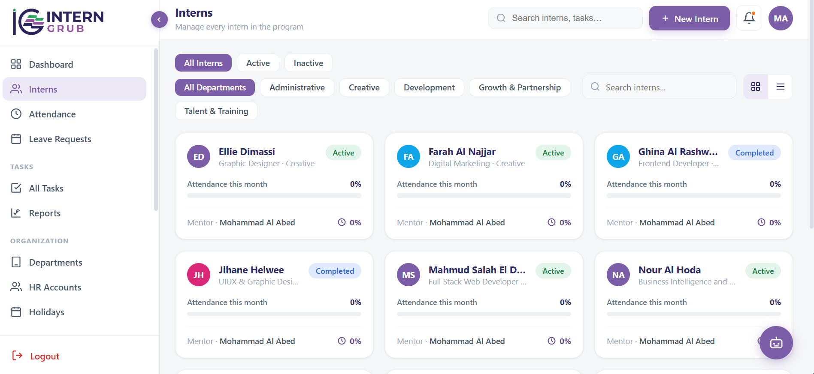
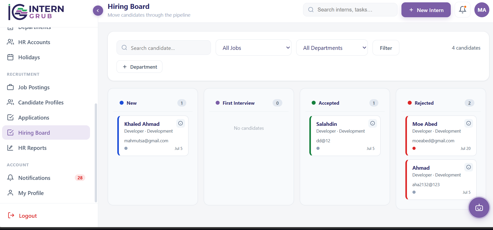
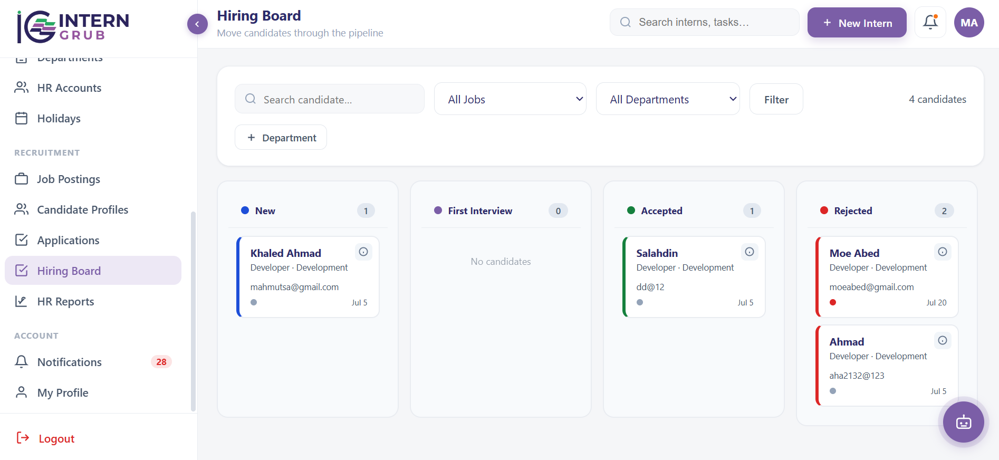
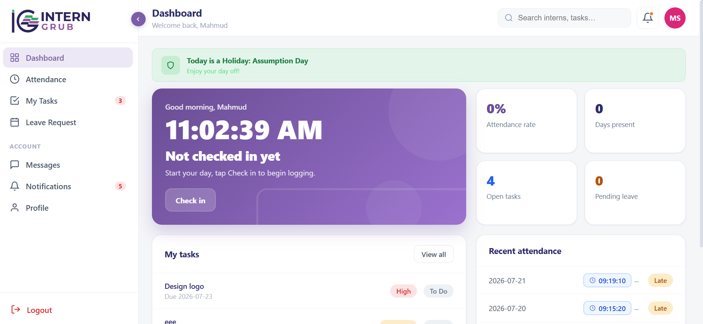

# InternGrub

A PHP-based intern and HR management platform covering attendance, task tracking, leave requests, hiring, and AI-assisted workflows across four distinct user roles.

## Overview

InternGrub manages the full lifecycle of an internship/HR program: HR staff post jobs and manage candidates through a hiring pipeline, admins/managers oversee interns and departments, and interns track their own attendance, tasks, and leave. It also integrates AI (via Groq's LLM API) to assist with task-related features.

## Tech Stack

- **Backend:** PHP (plain, no framework) with PDO for MySQL access
- **Frontend:** Custom HTML/CSS/JS
- **Email:** PHPMailer over Gmail SMTP (OTP-based password reset)
- **AI:** Groq API (Llama 3.3 70B) for AI-assisted task features
- **Database:** MySQL, schema in `database.sql`
- **Dependency management:** Composer

## Roles & Access

| Role | Access |
|---|---|
| Admin | Full system access |
| Manager | Scoped to their assigned department |
| HR | Hiring pipeline: jobs, candidates, applications |
| Intern | Personal dashboard: attendance, tasks, leave, messages |

Role checks are enforced server-side via `requireRole()` in `includes/auth.php`, which redirects users to their correct dashboard if they attempt to access a page outside their role.

## Key Features

### Authentication & Security
- Session-based login with brute-force protection: 5 failed attempts locks the account for 30 minutes
- Every login attempt (success or failure) is logged with username and IP (`login_log` table)
- Session cookies set HttpOnly and SameSite=Strict, Secure flag enabled automatically over HTTPS
- Session timeout after 2 hours of inactivity
- OTP-based password reset flow via email
- CSRF protection (`includes/csrf.php`) and centralized input validation (`includes/validate.php`)
- Automatic deactivation of interns whose internship end date has passed

### Admin
- Manage interns: add, edit, view profiles, deactivate
- Manage departments and HR accounts
- Attendance and leave oversight across the organization
- Task review and reporting
- Holiday calendar management
- Exportable reports

### HR
- Job postings management
- Candidate pipeline: applications, candidate profiles, candidate cards
- Visual hiring board (kanban-style pipeline)
- HR-to-candidate/intern messaging
- HR-specific reports
- AI-assisted chat (`hr/api_chat.php`)

### Intern
- Personal dashboard
- Attendance tracking
- Leave requests
- Task list with AI-assisted task updates
- Messaging (threaded conversations)
- Notifications
- Profile management

### AI Integration
- `includes/ai.php` wraps calls to Groq's chat completion API (Llama 3.3 70B model)
- Used for AI-assisted task handling (`admin/api_ai_task.php`, `intern` task flow) and HR chat (`hr/api_chat.php`)
- Requires a Groq API key (see Setup)

## Project Structure

```
interngrub/
├── admin/          # Admin panel: interns, departments, attendance, leave, reports, tasks
├── hr/             # HR panel: jobs, candidates, hiring board, messages, reports
├── intern/         # Intern panel: dashboard, attendance, tasks, leave, messages, notifications
├── assets/         # CSS, JS, images
├── includes/       # Shared PHP helpers: auth, config, mailer, AI wrapper, CSRF, validation
├── vendor/         # Composer dependencies (PHPMailer, etc.) — not committed, see Setup
├── dashboard.php   # Admin/manager dashboard entry point
├── index.php       # Login page
├── logout.php
└── database.sql    # Full database schema
```

## Setup

1. Clone the repo into your local server's web root (e.g. `htdocs` for XAMPP)
2. Run `composer install` to pull in dependencies (PHPMailer, etc.)
3. Import `database.sql` into MySQL to create the schema
4. Copy `includes/config.example.php` to `includes/config.php` and fill in:
   - Database credentials
   - Your Groq API key (from console.groq.com) for AI features
   - Gmail SMTP credentials (App Password) for password reset emails
5. Visit `index.php` in your browser to reach the login page

## Screenshots

### Login


### Admin Dashboard


### Interns


### HR Hiring Board


### Intern Dashboard


## Security Notes

Real database credentials, the AI API key, and SMTP credentials are excluded from version control via `.gitignore`. Only the example config template (`includes/config.example.php`) is committed. The `vendor/` directory is also excluded; run `composer install` to regenerate it locally.

## Status

Actively developed. Deployed to production on Hostinger for real internship/HR program use.
